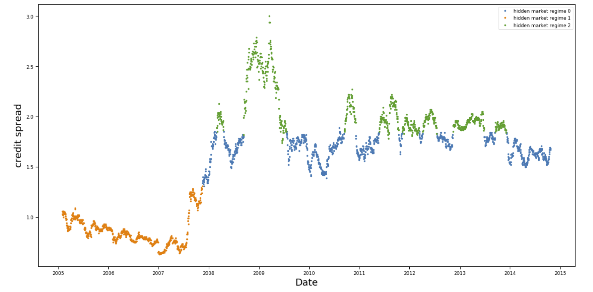
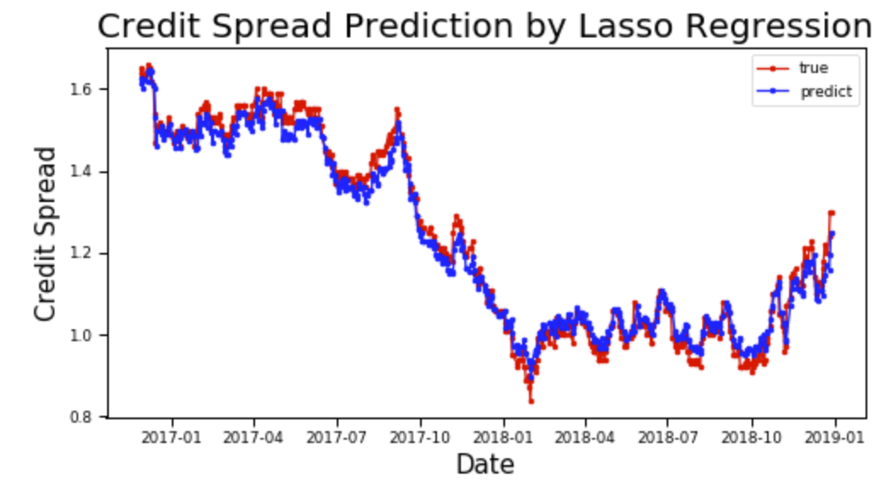
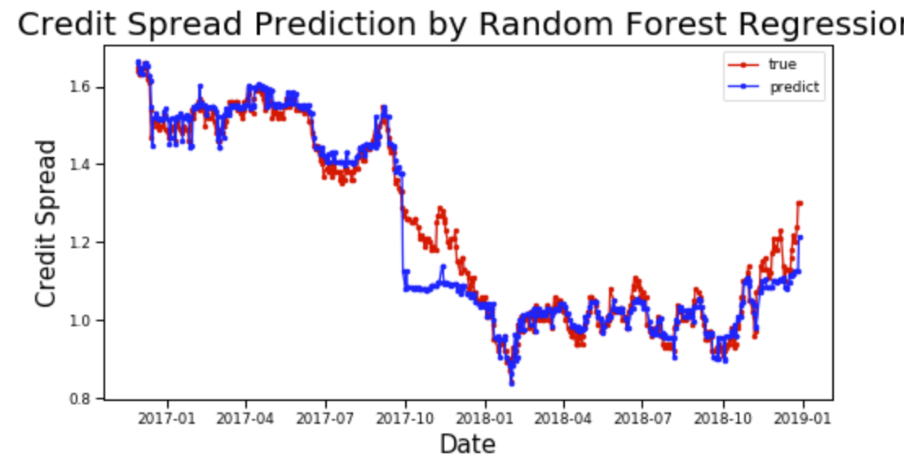

# Credit-Spread-predicting-machine-learning

Credit Spread indicates the risk premium of a risky security, which can serve as a measure of economic uncertainty. Successful prediction of movements in credit spread makes it possible for investors to develop profitable trading strategies. 

In this report, we selected various features with high predictive power on economic uncertainty, to be able to predict credit spread. We developed a pipeline for data preprocessing and feature engineering. We also used Hidden Markov Model to detect market regime shifting. Then, we developed an XGBoost model that proved to be more effective when compared to our linear regression benchmark model. Based on our prediction, we built a trading strategy on the correlated ETF.

## Feature correlation

## Regime detection

## Model results

